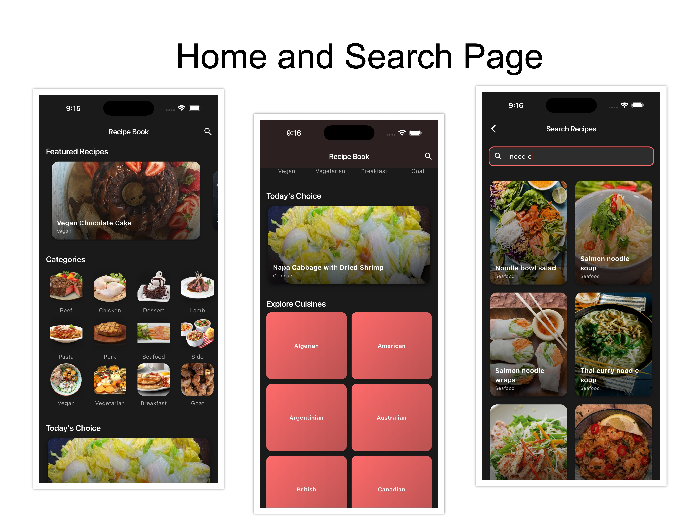
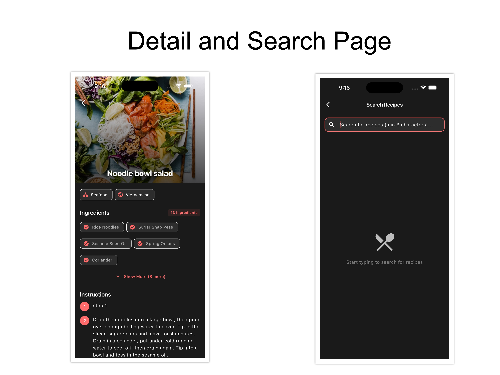

# 🍳 Recipe Book

A modern, feature-rich Flutter application for discovering and exploring recipes from around the world. Built with clean architecture principles, this app provides a seamless cooking experience with beautiful UI, smooth animations, and an intuitive design system.


## � Download APK

<div align="center">

### ✨ Try the App Now ✨

📦 **[Download Android APK (22.0MB)](https://drive.google.com/file/d/15ITExTcwrP2wSbqkAYcwuRlIXBU0vtyx/view?usp=sharing)**kAYcwuRlIXBU0vtyx/view?usp=sharing)**

Install and explore all features on your Android device!

</div>

## �📱 App Preview

### 📸 Screenshots

<div style="display: flex; flex-wrap: wrap; gap: 10px; justify-content: center; margin-bottom: 20px;">
  
  
</div>

## ✨ Key Features

### 🏠 Home Screen
- Featured recipes carousel with smooth animations
- Categorized meal sections
- Cuisine-based exploration
- Quick access to popular recipes
- Interactive category cards

### 🔍 Smart Search
- Real-time recipe search
- Debounced search for optimal performance
- Minimum 3 characters for search activation
- Empty state and error handling
- Search results with meal cards

### 📖 Detailed Recipe View
- High-quality meal images with parallax effect
- Expandable ingredients section with chips
- Show More/Less functionality (displays 5 initially)
- Step-by-step cooking instructions
- Ingredient measurements
- Video tutorial links
- Interactive ingredient chips (tap to explore)

### 🎯 Category & Cuisine Browsing
- Browse meals by category
- Explore international cuisines
- Filter by ingredient
- Grid view with beautiful cards
- Smooth navigation transitions

### 🎨 Modern UI/UX
- Material 3 design principles
- Consistent design system with custom components
- Dark theme support
- Smooth animations and transitions
- Responsive layouts
- Loading shimmer effects
- Error states with retry options

## 🛠 Technical Features

### Architecture
- **Clean Architecture** with clear separation of layers:
  - Domain Layer (Business Logic)
  - Data Layer (Repositories & Data Sources)
  - Presentation Layer (UI & State Management)
- **Feature-first** project structure
- **BLoC Pattern** for state management
- **Dependency Injection** with GetIt

### Design System
- Centralized design tokens (AppDimensions)
- Localization-ready strings (AppStrings)
- Reusable common widgets:
  - AppTextField with validation
  - AppText variants (DisplayLarge, Heading, Title, Body, Caption)
  - AppButton (Primary, Secondary, Outlined, Text)
  - AppSpacing (VSpace, HSpace)
  - ExpandableIngredients with chip design

### Code Quality
- Extracted methods for better readability
- Switch expressions for cleaner code
- Constant values instead of magic numbers
- Shallow nesting (2-3 levels max)
- Single Responsibility Principle
- DRY (Don't Repeat Yourself)
- Comprehensive error handling

### API Integration
- TheMealDB API integration
- HTTP client with proper error handling
- Response parsing and modeling
- Cached network images

### Performance Optimizations
- Image caching with cached_network_image
- Debounced search queries
- Lazy loading
- Optimized list rendering
- Tree-shaken icons (99.8% reduction)

## 🚀 Getting Started

### Prerequisites
- Flutter SDK 3.7.0 or higher
- Dart SDK (latest version)
- Android Studio / VS Code with Flutter extensions
- Git

### Installation

1. Clone the repository:
```bash
git clone <your-repo-url>
cd flutter_demo_hopscotch
```

2. Install dependencies:
```bash
flutter pub get
```

3. Run the app:
```bash
# For development
flutter run

# For Android release
flutter build apk --release

# For iOS release
flutter build ios --release
```

### Build APK

```bash
flutter build apk --release
```
Output: `build/app/outputs/flutter-apk/app-release.apk`

## 📁 Project Structure

```
lib/
├── common/                    # Common shared components
│   ├── constants/            # Design tokens and strings
│   │   ├── app_strings.dart
│   │   └── app_dimensions.dart
│   └── widgets/              # Reusable UI components
│       ├── app_text_field.dart
│       ├── app_text.dart
│       ├── app_button.dart
│       └── app_spacing.dart
├── core/                      # Core utilities
│   └── di/                   # Dependency injection
├── data/                      # Data layer
│   ├── datasources/          # API and local data sources
│   ├── models/               # Data models
│   └── repositories/         # Repository implementations
├── domain/                    # Domain layer
│   ├── entities/             # Business entities
│   ├── repositories/         # Repository contracts
│   └── usecases/             # Business use cases
└── presentation/             # Presentation layer
    ├── blocs/                # BLoC state management
    │   ├── home/
    │   ├── search/
    │   ├── meal_detail/
    │   └── category_meals/
    ├── pages/                # Screen pages
    │   ├── home/
    │   ├── search/
    │   ├── meal_detail/
    │   └── category_meals/
    └── widgets/              # Feature-specific widgets
        ├── meal_card.dart
        ├── section_title.dart
        ├── expandable_ingredients.dart
        └── error_view.dart
```

## 📦 Dependencies

### Core Dependencies
- **flutter_bloc**: ^8.1.3 - State management
- **get_it**: ^7.6.0 - Dependency injection
- **http**: ^1.1.0 - API calls
- **cached_network_image**: ^3.3.0 - Image caching
- **carousel_slider**: ^5.0.0 - Carousel widget

### UI Dependencies
- **shimmer**: ^3.0.0 - Loading effects
- **url_launcher**: ^6.2.1 - External links

## 🎯 Key Screens

### Home Page
- Featured recipes carousel
- Category sections
- Cuisine exploration
- Responsive grid layouts

### Search Page
- Real-time search with debouncing
- Search results grid
- Empty and error states

### Meal Detail Page
- Full-screen image with app bar
- Expandable ingredients (chip design)
- Step-by-step instructions
- Video tutorial button

### Category Meals Page
- Grid view of meals by category/cuisine/ingredient
- Pull-to-refresh functionality
- Error handling with retry

## 🧩 Custom Widgets

### ExpandableIngredients
- Displays ingredients as interactive chips
- Show More/Less functionality
- Initial display count: 5 items
- Tap to explore ingredient-based meals
- Measure badges on each chip

### MealCard
- Reusable meal card component
- Image with gradient overlay
- Category badge
- Tap animation

### AppButton
- 4 variants: Primary, Secondary, Outlined, Text
- 3 sizes: Small, Medium, Large
- Loading states
- Icon support

## 🎨 Design System

### Typography
- Display Large / Medium
- Heading
- Title / Subtitle
- Body
- Caption

### Spacing
- xs, sm, md, lg, xl, xxl variants
- Consistent padding system
- VSpace and HSpace widgets

### Dimensions
- Predefined padding values
- Border radius constants
- Icon size standards

## 🤝 Contributing

Contributions are welcome! Here's how you can help:

1. Fork the repository
2. Create your feature branch (`git checkout -b feature/AmazingFeature`)
3. Commit your changes (`git commit -m 'Add some AmazingFeature'`)
4. Push to the branch (`git push origin feature/AmazingFeature`)
5. Open a Pull Request

### Contribution Guidelines
- Follow clean architecture principles
- Use BLoC for state management
- Extract methods for better readability
- Use common widgets from design system
- Add proper error handling
- Format code with `dart format`
- Ensure no linting errors

## 🔧 Development Tips

### Code Quality
- Keep methods small (10-30 lines)
- Use constants instead of magic numbers
- Prefer composition over inheritance
- Extract complex widgets into separate files
- Use switch expressions for cleaner conditionals

### State Management
- Use BLoC for business logic
- Keep UI widgets simple and focused
- Handle loading, success, and error states
- Avoid putting logic in build methods

### Performance
- Use `const` constructors where possible
- Implement lazy loading for lists
- Cache images with `cached_network_image`
- Debounce user input where appropriate

## 📄 License

This project is licensed under the MIT License - see the [LICENSE](LICENSE) file for details.

## 🙏 Acknowledgments

- **TheMealDB API** for providing the recipe data
- Flutter community for excellent packages
- Material Design 3 for design guidelines

## 📞 Support

If you encounter any issues or have questions:
- Open an issue on GitHub
- Check existing documentation
- Review the code comments

---

Made with ❤️ using Flutter
